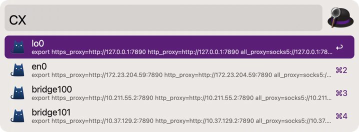
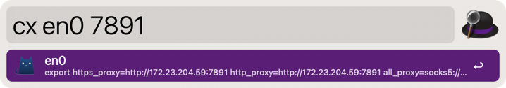

# alfred-clashx
Copy and patse ClashX terminal proxy command for multiple network interface

Chage port to 7891

## Requirements
+ Python3

## Install
click to [download](https://github.com/tarimoe/alfred-clashx/releases) and double-click the file to install

## Thank
+ [@ischaojie/ualfred](https://github.com/ischaojie/ualfred)